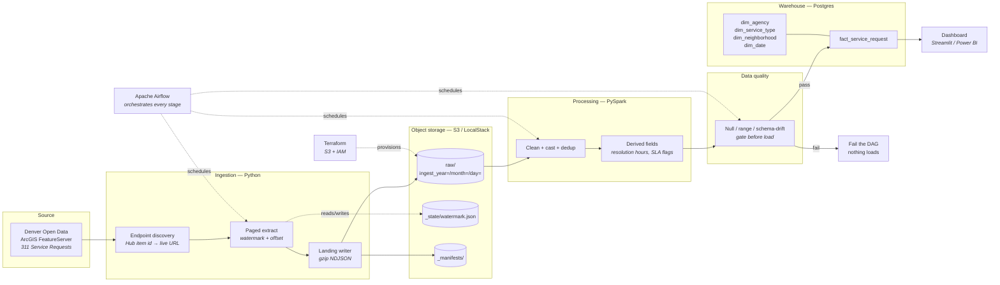
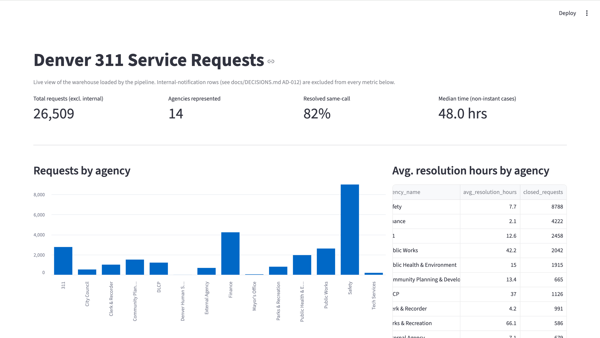
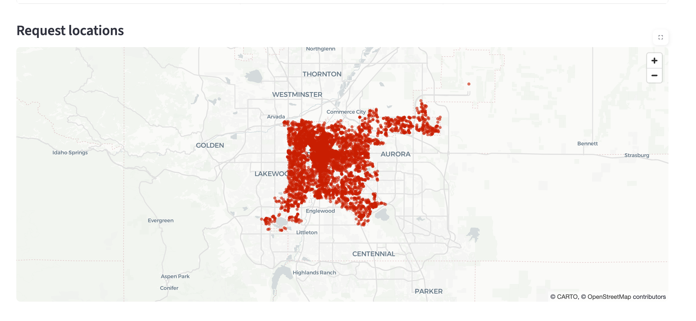

# Mile High Signal

**A scheduled ETL pipeline over Denver's 311 service-request feed — ingestion through warehouse to dashboard.**


---

## The problem this solves

Denver publishes 311 service requests — potholes, graffiti, illegal dumping, snow removal — as a
rolling 12-month feed on its Open Data portal. It's genuinely useful data and it's genuinely
awkward to work with:

- The API is a paged ArcGIS FeatureServer with a server-side record cap, so any single query
  silently truncates.
- Timestamps come back as epoch milliseconds, which look like plausible integers until your charts
  land in 1970.
- It's a *rolling window*. Records age out. If you only ever query it live, you have no history —
  and no way to answer "has pothole response time improved year over year?"
- There's no change-data-capture. Requests get updated in place, so a naive re-pull double-counts.

This pipeline turns that into a queryable warehouse with retained history, so questions like
*which agencies are slowest to close requests, and which neighborhoods wait longest* become a SQL
query instead of a scraping project.

**Why 311 and not RTD GTFS:** 311 has a stable, key-free REST endpoint with a reliable timestamp
column for incremental extraction. RTD's realtime feed is protobuf over a credentialed endpoint —
more moving parts, more to break in a portfolio repo someone else has to run.

---

## Architecture



### Build status

| # | Component | Status |
|---|-----------|--------|
| 1 | Ingestion (Python → S3) | ✅ Built, 21 tests passing |
| 2 | Processing (PySpark) | ✅ Built, 15 tests passing |
| 3 | Warehouse (Postgres, star schema) | ✅ Built, 15 tests passing, verified against a live database |
| 4 | Orchestration (Airflow) | ✅ DAG written and validated with Airflow's own DagBag loader |
| 5 | Data quality gates | ✅ Built, 18 tests passing |
| 6 | IaC (Terraform) | ✅ Written; not run here — HashiCorp's servers aren't reachable from this environment, run `terraform validate` locally |
| 7 | CI/CD (GitHub Actions) | ✅ Lint + format + tests, 80% coverage gate |
| 8 | Dashboard | ✅ Built, verified serving real data over HTTP |

All 69 automated tests pass. See "What's genuinely verified vs. what needs your machine" below for exactly what that does and doesn't cover.

### What's genuinely verified vs. what needs your machine

Every component above was built against real infrastructure while developing this,
not just written and assumed correct:

- **Ingestion**: pulled real data from Denver's live API (28,866 real records)
- **Transform + quality gate**: ran end-to-end with the quality gate wired in;
  caught two real bugs (a Spark SQL syntax error, a null-handling gap) that only
  surfaced under an actual full run, not the unit tests alone
- **Warehouse**: schema applied to and loaded into a real running Postgres
  instance; confirmed idempotent by loading the same batch twice and checking
  the row count didn't double; caught and fixed two real bugs (pandas represents
  missing strings and missing timestamps differently, and both broke naive SQL
  binding)
- **Dashboard**: launched as a real Streamlit server and got a real HTTP 200
  serving real warehouse data
- **Airflow DAG**: loaded and validated with Airflow's own `DagBag` — confirmed
  the task graph, schedule, and catchup setting are all correct — but never
  run on a live scheduler
- **Terraform**: written to standard conventions, but never run through
  `terraform validate` or `plan` — HashiCorp's release servers weren't
  reachable from the environment this was built in. Run `terraform validate`
  yourself before trusting it against a real AWS account.

---
## Dashboard




## Quickstart

```bash
git clone https://github.com/Namoos99/mile-high-signal.git
cd mile-high-signal

python -m venv .venv && source .venv/bin/activate
make install
cp .env.example .env

make up        # start LocalStack + Postgres
make describe  # print the live source schema — confirms connectivity
make smoke     # hit the API, write nothing
make ingest    # incremental run: land raw data in LocalStack S3
make ls-raw    # see what landed
make transform # clean with Spark, run the quality gate, write Parquet + a CSV preview
make preview   # open the CSV preview — the easiest way to actually look at the data
make load-warehouse # load cleaned data into the Postgres star schema
make dashboard # launch the Streamlit dashboard at localhost:8501
make pipeline  # or just run ingest -> transform -> load-warehouse in one shot
```

`make test` runs the full suite (69 tests) with no network and no credentials.

### Orchestration and infrastructure (heavier, optional)

```bash
make airflow-up    # Airflow webserver + scheduler, UI at localhost:8080 (admin/admin)
make airflow-down

cd terraform && terraform init && terraform validate && terraform plan
                   # needs the Terraform CLI + real AWS credentials — not run in
                   # this repo's automated verification; see note below
```

### Pointing at real AWS

Comment out `AWS_ENDPOINT_URL` in `.env`, set real credentials, set
`AUTO_CREATE_BUCKET=false`. No code changes. Every environment-dependent value is
resolved in `src/denver311/common/config.py` and nowhere else — no module below it reads
`os.environ` directly, which is what makes that claim true rather than aspirational.

---

## Repo layout

```
src/denver311/
  common/config.py          Typed settings — the only place env vars are read
  common/logging_setup.py   Console logs locally, JSON elsewhere
  ingestion/discovery.py    Resolve the live FeatureServer URL from a stable item id
  ingestion/arcgis_client.py  Paging, retries, epoch-ms handling
  ingestion/landing.py      S3 writes, manifests, watermark state
  ingestion/run_ingest.py   CLI entrypoint
tests/                      Stubbed source (responses) + stubbed S3 (moto)
docker/docker-compose.yml   LocalStack
terraform/                  S3 + IAM (pending)
dags/                       Airflow DAGs (pending)
spark_jobs/                 PySpark transforms (pending)
docs/DECISIONS.md           Every architecture decision, with the trade-off
```

---

## Design notes worth knowing

**Raw is immutable, gzipped NDJSON — not Parquet.** Raw should be a faithful copy of what the API
said. NDJSON absorbs a new source field without complaint; a fixed Parquet schema would reject it
or drop it silently, and you'd lose the ability to replay history. Parquet begins at the Spark
output.

**The watermark lives in S3, not Airflow XCom.** It has to survive Airflow being rebuilt, and a
backfill run executed outside Airflow entirely needs to read it. One JSON object is the cheapest
durable state that satisfies both.

**The watermark only advances after every file is durably written**, and never on a short read.
That gives at-least-once delivery — a crash mid-run means the next run re-reads the same window,
and dedup on `Case_Number` in the Spark layer makes that safe. The alternative (advance first)
gives at-most-once, where a crash loses records permanently and silently.

**The endpoint is discovered, not hardcoded.** Denver's dataset page carries a stable Hub item id;
the actual query host is an Esri-managed domain that can change when a service is republished. We
resolve item id → live URL at runtime. One extra HTTP call per run buys survival of a source
migration.

**Paging is ordered by `OBJECTID`.** Offset paging without a stable sort key can skip or duplicate
rows if the server reshuffles between requests.

Full reasoning for each: [`docs/DECISIONS.md`](docs/DECISIONS.md).

---

## What I'd do differently at scale

This is built for one city's rolling feed — call it low tens of millions of rows a year. Here's
where each choice breaks and what replaces it.

**Incremental extraction.** A single watermark on `Requested_Datetime` misses records that are
*updated* after creation — a request opened Monday and closed Friday never re-lands. At small
volume, a periodic full refresh papers over this. At scale you'd want either a second watermark on
the modified-date column, or genuine CDC from the source system, which for a public API means
negotiating access to the underlying database rather than the published layer.

**Object-storage watermark.** One JSON blob works for one pipeline. Ten pipelines, and you want a
proper metadata store — a control table in Postgres, or a purpose-built catalog — with per-partition
state, so a failed backfill of March doesn't block April.

**Single-threaded paging.** Offset paging is inherently sequential. For a much larger source you'd
partition the extraction by key range and parallelize, or push to bulk export where the source
supports it. Offset paging also degrades on the server side at high offsets.

**Spark for this volume is over-provisioned, deliberately.** At Denver's data size, DuckDB or plain
pandas would be faster and cheaper. Spark is here because the *pattern* is what matters — the code
is identical at 100× volume, and the switching cost later is high. I'd say this plainly in an
interview rather than pretending the volume justifies it.

**Star schema in Postgres.** Fine to a few hundred million rows with good partitioning and indexes.
Beyond that, Postgres struggles with wide analytical scans and you'd move the fact table to a
columnar store — Redshift, Snowflake, or Iceberg-on-S3 with a query engine over it. Iceberg is the
interesting one: it would also give schema evolution and time travel on the raw layer, which the
current NDJSON approach only approximates.

**Data quality as a hard gate.** Failing the DAG on a bad batch is correct at one dataset. Across
many, it becomes an outage generator — one flaky source blocks everything. You'd move to severity
tiers: hard-fail on schema drift and key violations, quarantine-and-continue on row-level anomalies,
and alert on distribution shifts without blocking.

**No data contracts.** The pipeline currently discovers schema drift after the fact. A better setup
declares the expected schema up front and validates against it at the boundary, so a source change
fails at ingestion with a clear message rather than at load time with a cast error.

**Observability is logs and a manifest.** That's honest for this scale but thin. Production wants
freshness SLAs, row-count anomaly detection against historical baselines, and lineage — so when a
dashboard number looks wrong, you can trace it back to the run that produced it.

---

## License

MIT
